# Architecture Decision Document & Technical Architecture Overview
**Student Thrift Hub - Peer-to-Peer Student Marketplace**

**Document Version:** 1.0  
**Date:** May 11, 2026  
**Status:** Active Development  
**Author:** Technical Architecture Team

---

## Table of Contents

1. [Executive Summary](#executive-summary)
2. [System Context Diagram](#system-context-diagram)
3. [C4 Container Diagram](#c4-container-diagram)
4. [Technology Stack Explanation](#technology-stack-explanation)
5. [Data Architecture](#data-architecture)
6. [Integration Architecture](#integration-architecture)
7. [Deployment Architecture](#deployment-architecture)
8. [Scalability & Performance Strategy](#scalability--performance-strategy)
9. [Security Architecture](#security-architecture)
10. [Key Architecture Decisions](#key-architecture-decisions)

---

## Executive Summary

**Student Thrift Hub** is a modern peer-to-peer marketplace platform designed specifically for students to buy and sell used items sustainably. The architecture follows a **three-tier cloud-native design** with a React 18 single-page application (SPA) frontend, serverless backend functions, and PostgreSQL database on Supabase.

### Architecture Highlights

- **Frontend**: React 18 SPA with TypeScript, Vite build tool, and Tailwind CSS
- **Backend**: Serverless Supabase Edge Functions with PostgreSQL database
- **Authentication**: JWT-based via Supabase Auth with OAuth2 support
- **State Management**: React Context + TanStack React Query with client-side caching
- **Database**: PostgreSQL with Row-Level Security (RLS) for multi-tenancy
- **Deployment**: Vercel/Netlify for frontend, Supabase Cloud for backend
- **Payment Processing**: SePay integration with webhook support
- **Real-time Features**: Supabase Realtime for live updates

### Key Architectural Principles

| Principle | Implementation |
|-----------|-----------------|
| **Separation of Concerns** | Clear layering: presentation, application, data |
| **Stateless Design** | No server-side sessions; JWT-based authentication |
| **Database-Centric Security** | Row-Level Security (RLS) enforces access control |
| **Scalability First** | Serverless architecture with auto-scaling |
| **Developer Experience** | Type-safe TypeScript throughout the stack |
| **Performance Optimized** | CDN delivery, client-side caching, lazy loading |

---

## System Context Diagram

This diagram illustrates the system boundaries and external dependencies:

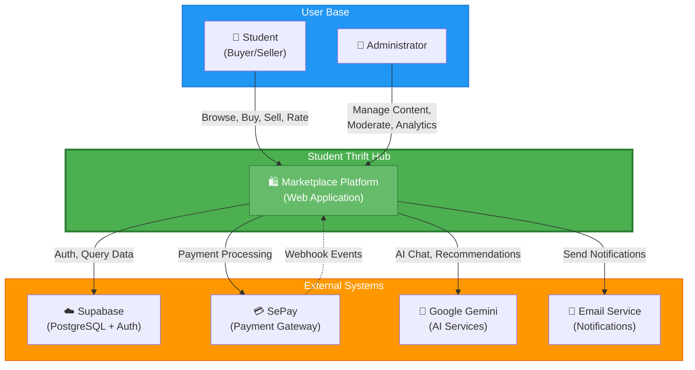

### External System Dependencies

| System | Type | Purpose | Integration |
|--------|------|---------|-------------|
| **Supabase** | Database/Auth | PostgreSQL hosting, authentication, real-time | Direct HTTP/WebSocket |
| **SePay** | Payment Gateway | Process transactions, manage payments | REST API + Webhooks |
| **Google Gemini** | AI/ML | AI chat widget, product recommendations | REST API |
| **Email Service** | Communication | Order notifications, password reset | SMTP/API |

---

## C4 Container Diagram

This diagram shows the major technology containers and their interactions:

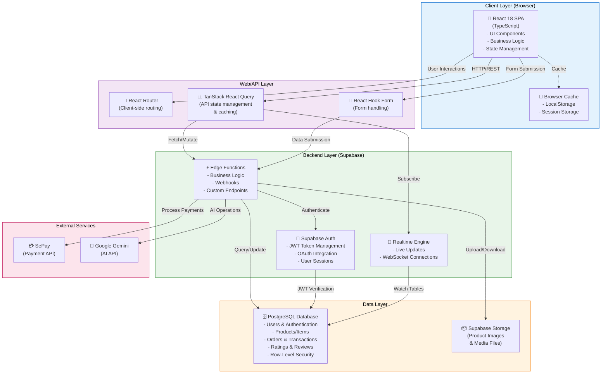

### Container Details

| Container | Technology | Responsibilities |
|-----------|-----------|------------------|
| **React SPA** | React 18 + TypeScript | UI rendering, user interactions, state management |
| **React Router** | React Router v6.30.1 | Client-side routing, navigation |
| **React Query** | TanStack React Query v5.83.0 | API state, caching, synchronization |
| **Forms** | React Hook Form v7.61.1 | Form validation, submission handling |
| **Supabase Auth** | Supabase Auth | User authentication, JWT management |
| **Edge Functions** | Supabase Edge Functions | Backend business logic, webhook handling |
| **Realtime Engine** | Supabase Realtime | Live data updates, WebSocket connections |
| **PostgreSQL** | PostgreSQL 14+ | Persistent data storage |
| **Storage** | Supabase Storage | File/media storage |

---

## Technology Stack Explanation

### Frontend Technology Stack

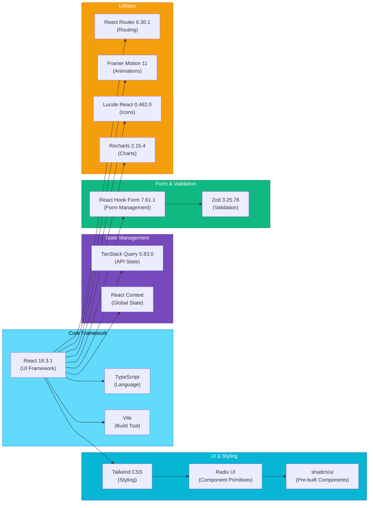

### Backend Technology Stack

| Component | Technology | Version | Purpose |
|-----------|-----------|---------|---------|
| **Language** | TypeScript | Latest | Type-safe edge function development |
| **Database** | PostgreSQL | 14+ | Relational data storage with RLS |
| **Authentication** | Supabase Auth | Latest | OAuth2, JWT tokens, user management |
| **Serverless** | Supabase Edge Functions | Latest | Deno runtime, zero cold starts |
| **Realtime** | Supabase Realtime | Latest | WebSocket-based live updates |
| **Storage** | Supabase Storage | Latest | S3-compatible file storage |
| **SDK** | @supabase/supabase-js | 2.101.1 | TypeScript client library |

### Development & Testing

| Tool | Version | Purpose |
|------|---------|---------|
| **Package Manager** | Bun | Fast, performant package installation |
| **Test Runner** | Vitest | Unit testing framework |
| **E2E Testing** | Playwright | End-to-end testing |
| **Linting** | ESLint | Code quality and consistency |
| **CSS Processing** | PostCSS | CSS transformation and optimization |

---

## Data Architecture

### Database Schema Overview

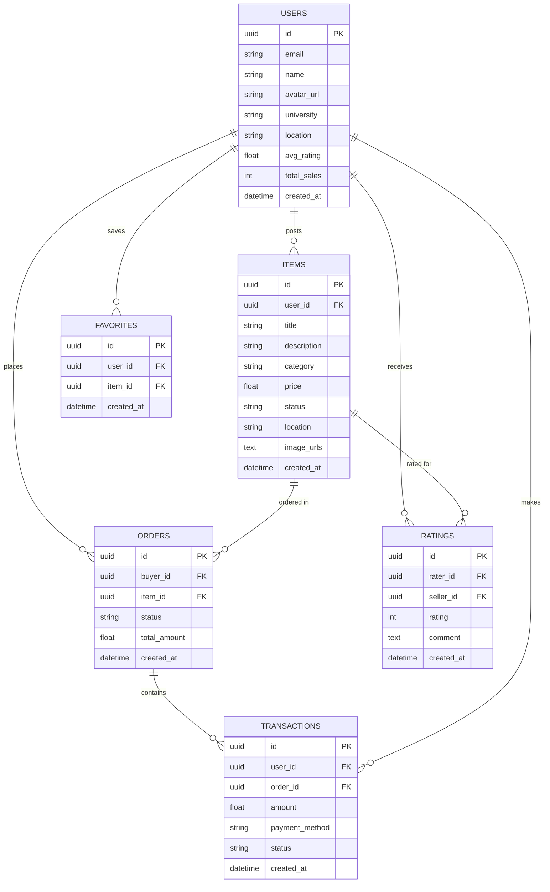

### Core Tables

| Table | Purpose | Key Fields |
|-------|---------|-----------|
| **users** | User profiles and authentication | id, email, name, university, location, ratings |
| **items** | Product listings | id, user_id, title, price, category, location, status |
| **orders** | Purchase transactions | id, buyer_id, item_id, status, total_amount |
| **ratings** | Seller ratings and reviews | id, rater_id, seller_id, rating, comment |
| **transactions** | Payment records | id, user_id, order_id, amount, payment_method |
| **favorites** | Saved items | id, user_id, item_id |

### Row-Level Security (RLS) Policy

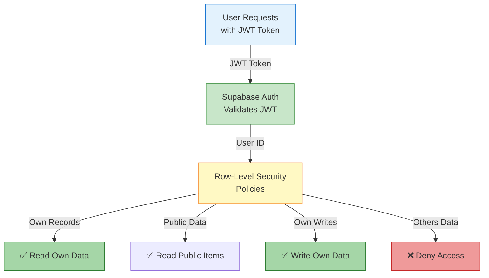

### Data Storage Strategy

- **Hot Data**: User sessions, active orders → In-memory caching via React Query
- **Warm Data**: Products, user profiles → Database with HTTP caching headers
- **Cold Data**: Archived transactions, historical data → PostgreSQL with slow access

---

## Integration Architecture

### External Service Integrations

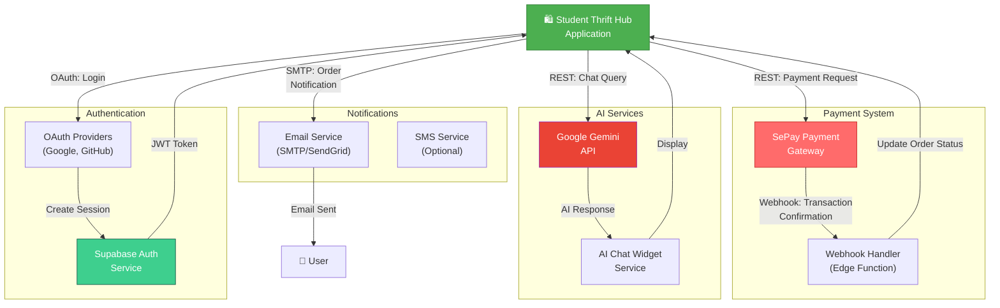

### Integration Points

| System | Type | Direction | Protocol | Purpose |
|--------|------|-----------|----------|---------|
| **SePay** | Payment | Bidirectional | REST + Webhook | Process payments, confirm transactions |
| **Google Gemini** | AI | Request-Response | REST API | Chat, recommendations, moderation |
| **OAuth Providers** | Authentication | Outbound | OAuth2 | User login, registration |
| **Email Service** | Notifications | Outbound | SMTP/API | Order notifications, alerts |
| **Supabase** | Database | Bidirectional | HTTP/WebSocket | Data persistence, real-time updates |

### Webhook Architecture

```
SePay Transaction Complete
        ↓
Webhook Endpoint (Edge Function)
        ↓
Validate HMAC Signature
        ↓
Query Order from Database
        ↓
Update Order Status
        ↓
Update User Deposit/Balance
        ↓
Send Confirmation Email
        ↓
Log Transaction
```

---

## Deployment Architecture

### Production Deployment Architecture

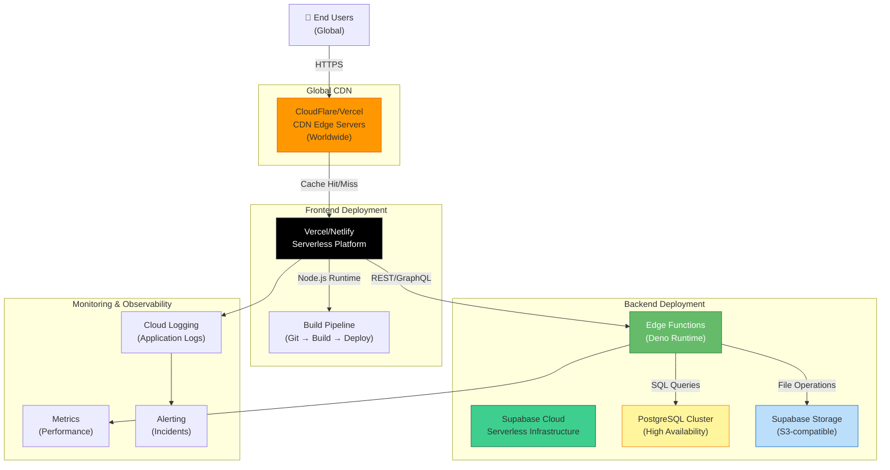

### Deployment Environments

| Environment | Frontend | Backend | Database | Purpose |
|-------------|----------|---------|----------|---------|
| **Development** | Local/Vercel Preview | Local Edge Function | Supabase Dev | Testing features |
| **Staging** | Vercel Preview Branch | Supabase Edge Functions | Supabase Staging | QA & integration tests |
| **Production** | Vercel Main | Supabase Edge Functions | Supabase Production | Live application |

### CI/CD Pipeline

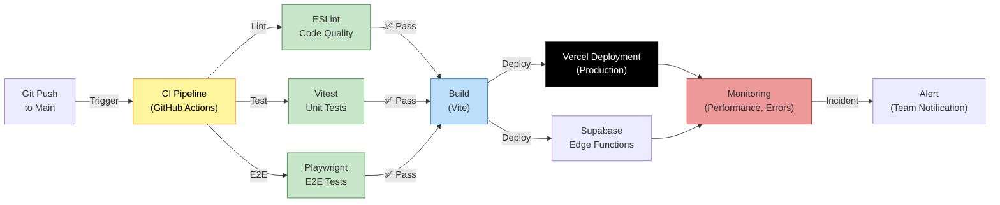

---

## Scalability & Performance Strategy

### Horizontal Scalability

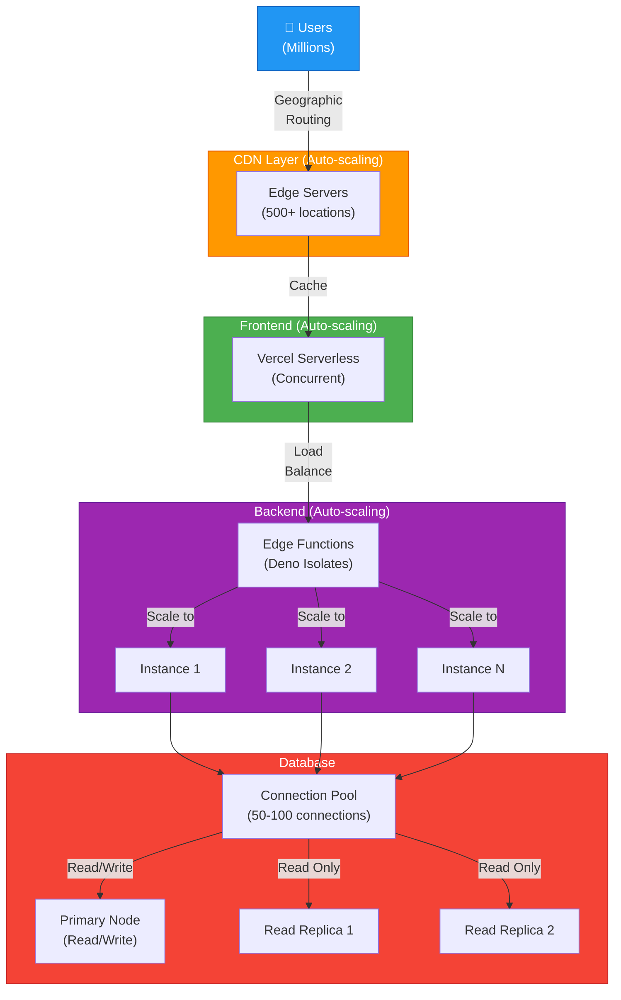

### Caching Strategy

| Layer | Technology | TTL | Hit Rate Target |
|-------|-----------|-----|-----------------|
| **Edge CDN** | CloudFlare Cache | 1 hour | 80% |
| **Browser** | HTTP Cache Headers | 5 min | 60% |
| **React Query** | In-Memory | 5 min | 70% |
| **Database** | Query Result Cache | 1 min | 40% |
| **Supabase Storage** | CDN | 24 hours | 85% |

### Performance Optimization Techniques

```mermaid
graph TD
    A["Performance<br/>Optimization"]
    
    A --> B["Frontend"]
    B --> B1["Code Splitting<br/>(Lazy Routes)"]
    B --> B2["Image Optimization<br/>(WebP, Responsive)"]
    B --> B3["Tree Shaking<br/>(Unused Code)"]
    B --> B4["Minification<br/>(Vite Bundle)"]
    B --> B5["Bundle Analysis<br/>(Monitor Size)"]
    
    A --> C["API Layer"]
    C --> C1["Request Batching<br/>(N+1 Prevention)"]
    C --> C2["Pagination<br/>(Cursor-based)"]
    C --> C3["Selective Fields<br/>(GraphQL-like)"]
    C --> C4["Compression<br/>(Gzip/Brotli)"]
    
    A --> D["Database"]
    D --> D1["Query Indexing<br/>(On hot queries)"]
    D --> D2["Connection Pooling<br/>(PgBouncer)"]
    D --> D3["Query Optimization<br/>(Explain Plans)"]
    D --> D4["Partitioning<br/>(By date/user)"]
    
    A --> E["Infrastructure"]
    E --> E1["Regional CDN<br/>(Edge Caching)"]
    E --> E2["HTTP/2 Push<br/>(Preload Resources)"]
    E --> E3["Compression<br/>(Asset Size)"]
    E --> E4["Database Replicas<br/>(Read Scaling)"]
    
    style A fill:#4CAF50,stroke:#2E7D32,color:#fff
    style B fill:#BBDEFB,stroke:#1976D2
    style C fill:#FFE0B2,stroke:#F57C00
    style D fill:#E1BEE7,stroke:#7B1FA2
    style E fill:#C8E6C9,stroke:#388E3C
```

### Performance Targets

| Metric | Target | Monitoring |
|--------|--------|-----------|
| **First Contentful Paint (FCP)** | < 1.5s | Lighthouse, Web Vitals |
| **Largest Contentful Paint (LCP)** | < 2.5s | Web Vitals |
| **Cumulative Layout Shift (CLS)** | < 0.1 | Web Vitals |
| **API Response Time** | < 200ms (p95) | Application Metrics |
| **Database Query Time** | < 50ms (p95) | Query Logs |
| **Time to Interactive (TTI)** | < 3s | Lighthouse |

---

## Security Architecture

### Defense-in-Depth Model

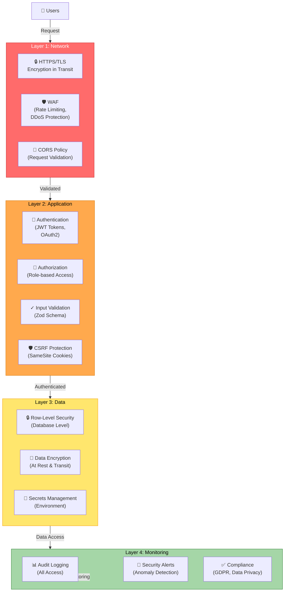

### Authentication & Authorization Flow

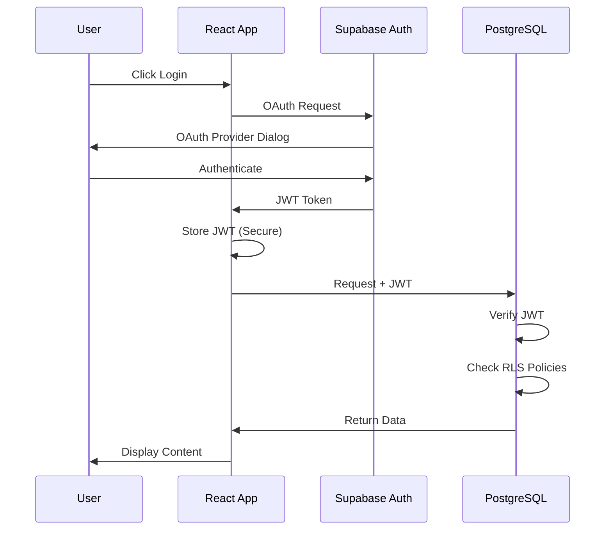

### Key Security Measures

| Area | Implementation | Details |
|------|---|---------|
| **Authentication** | JWT + OAuth2 | Supabase Auth with Google/GitHub |
| **Authorization** | Role-Based Access Control (RBAC) | Admin, Seller, Buyer roles |
| **Data Access** | Row-Level Security (RLS) | Database enforces user isolation |
| **Encryption** | TLS 1.3 in transit, AES-256 at rest | All sensitive data encrypted |
| **Password Policy** | Strong requirements | Min 12 chars, complexity rules |
| **Session Management** | JWT tokens (no cookies) | Stateless, 24-hour expiration |
| **CSRF Protection** | SameSite cookies, CORS validation | Prevent cross-site attacks |
| **XSS Prevention** | React DOM sanitization | No innerHTML, Content Security Policy |
| **SQL Injection** | Parameterized queries | Supabase client prevents injection |
| **Rate Limiting** | Per-user, per-endpoint | Prevent brute force, DoS |
| **Audit Logging** | All sensitive operations | Track user actions, payment events |
| **Secrets Management** | Environment variables | Never commit API keys |

### Sensitive Data Handling

```
User Input
    ↓
[Validation - Zod Schema]
    ↓
[Type Checking - TypeScript]
    ↓
[Parameterized Query]
    ↓
[PostgreSQL with RLS]
    ↓
[Encryption at Rest]
    ↓
[TLS on Transit]
    ↓
[Response to Client]
```

---

## Key Architecture Decisions

### ADR (Architecture Decision Records)

#### ADR-001: Frontend Framework Choice

**Decision**: Use React 18 with TypeScript and Vite

**Rationale**:
- React's component model provides excellent code reusability
- Large ecosystem and community support
- TypeScript ensures type safety and reduces runtime errors
- Vite offers faster build times and HMR compared to Webpack

**Alternatives Considered**:
- Vue.js: Less suitable for complex state management
- Svelte: Smaller ecosystem, steeper learning curve for team

**Trade-offs**:
- Larger bundle size vs. better developer experience
- More boilerplate vs. type safety and maintainability

---

#### ADR-002: Backend Architecture - Serverless

**Decision**: Use Supabase Edge Functions instead of traditional servers

**Rationale**:
- No infrastructure management required
- Auto-scaling for variable workloads
- Cost-effective (pay per execution)
- Faster deployment cycles
- Integration with PostgreSQL and Auth built-in

**Alternatives Considered**:
- Express.js + Node.js server: Requires ops overhead
- AWS Lambda: More vendor lock-in
- Firebase Functions: Higher latency

**Trade-offs**:
- Cold starts (mitigated by Deno runtime)
- Limited execution time (not suitable for batch jobs)
- Vendor lock-in to Supabase

---

#### ADR-003: State Management Strategy

**Decision**: React Context + TanStack React Query (not Redux)

**Rationale**:
- React Query excels at API state and server synchronization
- Context API sufficient for global UI state
- Reduces boilerplate compared to Redux
- Modern alternative proven in production
- Better code splitting and performance

**Alternatives Considered**:
- Redux: Overkill for most use cases, verbose
- Zustand: Good but Query solves more problems out-of-box
- Jotai: Emerging library, less battle-tested

**Trade-offs**:
- Learning curve for Query patterns
- Less suitable for complex offline-first apps

---

#### ADR-004: Database Choice - PostgreSQL

**Decision**: PostgreSQL with Row-Level Security (RLS)

**Rationale**:
- ACID compliance ensures data integrity
- Row-Level Security enables multi-tenancy without application logic
- JSON support for flexible data structures
- Excellent indexing for query performance
- Managed service via Supabase reduces ops

**Alternatives Considered**:
- MongoDB: Weaker relational support, schema-less complexity
- Firebase Realtime DB: Limited query capabilities

**Trade-offs**:
- Relational schema requires upfront design
- RLS policies can be complex to debug

---

#### ADR-005: Authentication Strategy

**Decision**: JWT-based authentication via Supabase Auth

**Rationale**:
- Stateless (no server-side sessions)
- OAuth2 integration for third-party login
- Secure token management
- Built into Supabase platform
- Better for distributed systems and mobile

**Alternatives Considered**:
- Session-based cookies: Scalability challenges
- API keys: Less secure for user authentication

**Trade-offs**:
- Token refresh complexity
- Cannot revoke tokens immediately (mitigated by short expiry)

---

#### ADR-006: Payment Processing Integration

**Decision**: SePay webhook-based integration

**Rationale**:
- Webhook approach decouples payment from main application
- SePay handles compliance and security
- Transaction confirmation via webhook ensures reliability
- Reduces direct payment exposure

**Alternatives Considered**:
- Direct payment processing: Higher PCI compliance burden
- Other gateways: SePay optimal for student market

**Trade-offs**:
- Webhook reliability dependency
- Eventual consistency in order status

---

#### ADR-007: Deployment Strategy

**Decision**: Frontend on Vercel, Backend on Supabase Cloud

**Rationale**:
- Vercel optimized for React/Next deployment
- Zero-config deployment with Git integration
- Supabase Cloud handles all backend infrastructure
- Global CDN distribution
- Automatic SSL certificates

**Alternatives Considered**:
- Docker on AWS ECS: More operational overhead
- Heroku: Higher costs, less flexible scaling
- Self-hosted: Requires DevOps expertise

**Trade-offs**:
- Vendor lock-in to Vercel and Supabase
- Regional latency for non-optimized regions

---

#### ADR-008: Image Storage Solution

**Decision**: Supabase Storage (S3-compatible) with CDN

**Rationale**:
- S3 compatibility ensures portability
- Built-in CDN for global distribution
- Cost-effective for marketplace with many images
- Integrated with Supabase ecosystem

**Alternatives Considered**:
- Database BLOBs: Poor query performance
- Cloudinary: Higher costs for volume

**Trade-offs**:
- S3 bucket complexity vs. simplicity
- Vendor-specific implementation

---

#### ADR-009: Real-time Features

**Decision**: Supabase Realtime via WebSocket

**Rationale**:
- Live product updates without polling
- Order status real-time notifications
- Bidirectional communication
- Integrated with database subscriptions

**Alternatives Considered**:
- Polling: Inefficient, high server load
- Socket.io: Requires additional infrastructure

**Trade-offs**:
- WebSocket connection overhead
- Complexity in state synchronization

---

#### ADR-010: Testing Strategy

**Decision**: Vitest for unit tests, Playwright for E2E tests

**Rationale**:
- Vitest: Fast, ESM-native, excellent DX
- Playwright: Cross-browser, reliable, headless support
- Both maintain high code quality standards

**Alternatives Considered**:
- Jest: Slower, more configuration
- Cypress: Good but heavier than Playwright

**Trade-offs**:
- Learning curve for new tools
- Test maintenance overhead

---

### Architecture Constraints & Assumptions

| Category | Item | Implication |
|----------|------|-------------|
| **Technical** | PostgreSQL is primary data store | Relational schema design required |
| **Technical** | JWT tokens used for auth | 24-hour expiration window |
| **Business** | SePay payment processing | Transaction fees 2-3% |
| **Operational** | Supabase Cloud dependency | Vendor lock-in to Supabase |
| **Performance** | Database query < 50ms | Requires proper indexing strategy |
| **Security** | RLS policies enforce access | No application-level bypass |

---

### Future Architectural Considerations

1. **Microservices Extraction**: If order management scales significantly, consider extracting as separate service
2. **Message Queue**: For async operations (email, notifications), consider event-driven architecture
3. **Search Engine**: Elasticsearch for advanced product search if needed
4. **Analytics Platform**: Custom analytics for marketplace metrics
5. **Mobile Apps**: Native iOS/Android with same backend
6. **GraphQL Migration**: Consider GraphQL for complex query patterns
7. **Caching Layer**: Redis for high-frequency queries if needed

---

### Monitoring & Observability

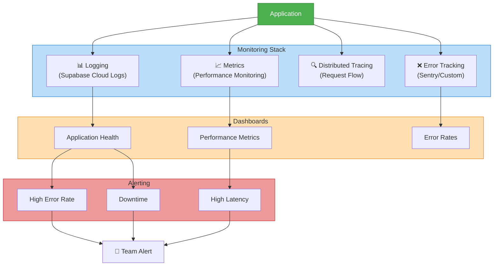

---

## Glossary

| Term | Definition |
|------|-----------|
| **JWT** | JSON Web Token - stateless authentication token |
| **RLS** | Row-Level Security - database-level access control |
| **Edge Function** | Serverless function running at geographic edge |
| **SPA** | Single Page Application - React application |
| **CDN** | Content Delivery Network - distributed caching |
| **OAuth2** | Open authorization protocol for third-party login |
| **RBAC** | Role-Based Access Control - permission model |
| **ACID** | Atomicity, Consistency, Isolation, Durability - database guarantees |
| **RTO** | Recovery Time Objective - max time to restore service |
| **RPO** | Recovery Point Objective - acceptable data loss |

---

## Document History

| Version | Date | Author | Changes |
|---------|------|--------|---------|
| 1.0 | May 11, 2026 | Architecture Team | Initial comprehensive architecture document |

---

## References & Related Documents

- [PROJECT_OVERVIEW.md](PROJECT_OVERVIEW.md) - Project features and structure
- [SOFTWARE_DESIGN_DOCUMENT.md](SOFTWARE_DESIGN_DOCUMENT.md) - Detailed design patterns
- [SRS.md](SRS.md) - Software Requirements Specification
- Supabase Documentation: https://supabase.com/docs
- React Documentation: https://react.dev
- Vite Documentation: https://vitejs.dev
- Playwright Documentation: https://playwright.dev

---

**Document Status**: Active | **Last Updated**: May 11, 2026 | **Next Review**: June 11, 2026
