# Software Design Document (SDD)
## Student Thrift Hub - Peer-to-Peer Student Marketplace

**Document Version:** 1.0  
**Date:** May 11, 2026  
**Status:** Active Development  
**Project:** Student Thrift Hub (StuMarket)  
**Author:** Technical Architecture Team

---

## Table of Contents

1. [System Architecture Overview](#1-system-architecture-overview)
2. [High-Level Design (C4 Model)](#2-high-level-design-c4-model)
3. [Component Diagram](#3-component-diagram)
4. [Data Flow Diagram](#4-data-flow-diagram)
5. [Database Design](#5-database-design)
6. [API Design](#6-api-design)
7. [Design Patterns & Principles](#7-design-patterns--principles)
8. [Module Breakdown](#8-module-breakdown)
9. [Technology Stack & Justifications](#9-technology-stack--justifications)
10. [Security Architecture](#10-security-architecture)
11. [Performance Considerations](#11-performance-considerations)
12. [Deployment Architecture](#12-deployment-architecture)

---

## 1. System Architecture Overview

### 1.1 Architecture Type

**Student Thrift Hub** follows a **three-tier modern web architecture** with clear separation of concerns:

```
┌─────────────────────────────────────────────────────────────┐
│                     PRESENTATION LAYER                      │
│        React 18 SPA with Tailwind CSS + shadcn/ui          │
└─────────────────────────────────────────────────────────────┘
                              ↑ HTTP/REST
┌─────────────────────────────────────────────────────────────┐
│                     APPLICATION LAYER                       │
│  Supabase Edge Functions, Authentication, Business Logic   │
└─────────────────────────────────────────────────────────────┘
                              ↑ SQL/Realtime
┌─────────────────────────────────────────────────────────────┐
│                      DATA LAYER                             │
│   PostgreSQL Database with Row-Level Security (RLS)        │
└─────────────────────────────────────────────────────────────┘
```

### 1.2 Core Principles

- **Microservices-Lite**: Supabase Edge Functions provide serverless backend logic
- **Client-Driven**: Heavy lifting on frontend using React Query and client-side caching
- **Database-Centric**: PostgreSQL with RLS enforces security at database level
- **Real-time First**: Supabase Realtime for live updates across clients
- **Stateless**: No server-side sessions; JWT-based authentication

### 1.3 Key Architectural Characteristics

| Aspect | Decision | Rationale |
|--------|----------|-----------|
| **Backend** | Serverless (Supabase Edge Functions) | Reduced ops overhead, auto-scaling, cost-effective |
| **State Management** | React Context + React Query | Lightweight, no Redux complexity; query caching |
| **Database** | PostgreSQL on Supabase | Proven relational model, RLS for multi-tenancy |
| **Deployment** | Vercel/Netlify (frontend) + Supabase Cloud | Standalone, auto-scaling, CDN-backed |
| **Authentication** | JWT tokens via Supabase Auth | Stateless, OAuth2-compatible, no sessions |

---

## 2. High-Level Design (C4 Model)

### 2.1 C4 Context Diagram

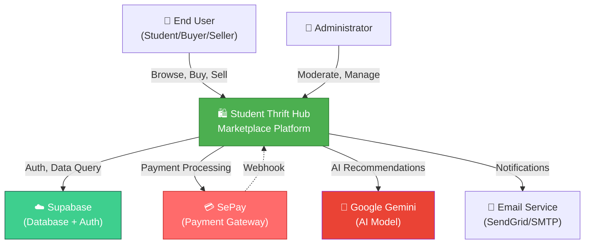

### 2.2 C4 Container Diagram

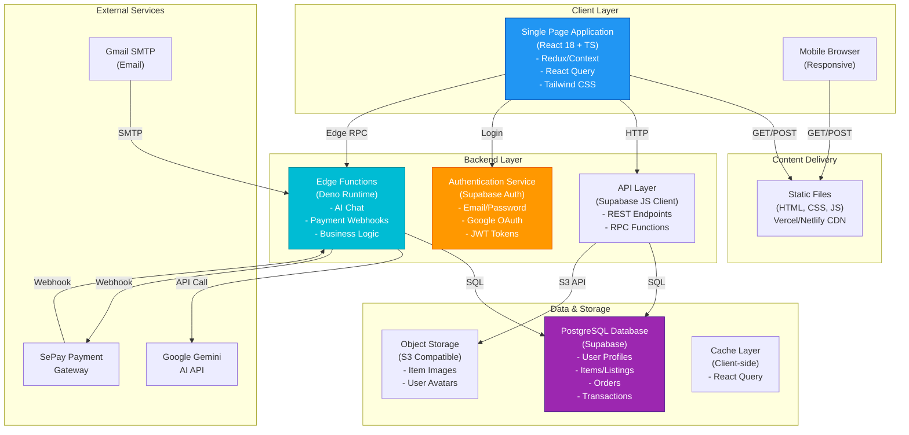

### 2.3 System Interactions

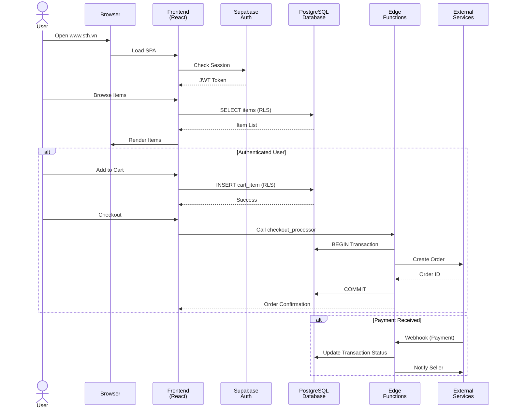

---

## 3. Component Diagram

### 3.1 Frontend Component Architecture

```mermaid
graph TB
    subgraph App["App Container"]
        Router["React Router<br/>(6.x)"]
        Auth["Auth Provider<br/>(Context)"]
        Query["QueryClientProvider<br/>(React Query)"]
    end
    
    subgraph Layout["Layout Components"]
        Nav["Navbar<br/>- Logo<br/>- Search Bar<br/>- Auth Links"]
        Footer["Footer<br/>- Links<br/>- Info"]
        AIChatWidget["AI Chat Widget<br/>- Float Button<br/>- Modal Chat"]
    end
    
    subgraph Pages["Page Components"]
        Index["Index/Browse<br/>- Product Grid<br/>- Filters<br/>- Search Results"]
        ItemDetail["Item Detail<br/>- Images<br/>- Description<br/>- Seller Info<br/>- Reviews"]
        PostItem["Post Item<br/>- Form<br/>- Upload<br/>- Category"]
        Cart["Shopping Cart<br/>- Item List<br/>- Quantity<br/>- Totals"]
        Checkout["Checkout<br/>- Shipping Address<br/>- Order Summary<br/>- Payment"]
        Auth["Auth Page<br/>- Login<br/>- SignUp<br/>- OAuth"]
        Profile["User Profile<br/>- Settings<br/>- History<br/>- Preferences"]
        Admin["Admin Panel<br/>- User Mgmt<br/>- Content Mod<br/>- Analytics"]
    end
    
    subgraph UI["UI Component Library"]
        Button["Button"]
        Input["Input"]
        Dropdown["Dropdown"]
        Modal["Modal/Dialog"]
        Card["Card"]
        Badge["Badge"]
        Tabs["Tabs"]
    end
    
    subgraph Hooks["Custom Hooks"]
        UseAuth["useAuth<br/>- User State<br/>- Auth Methods"]
        UseQuery["useQuery<br/>- Data Fetching<br/>- Caching"]
        UseMobile["useMobile<br/>- Responsive"]
        UseLocationPicker["useLocationPicker<br/>- Geo Selection"]
    end
    
    subgraph Integration["Integration Layer"]
        SupabaseClient["Supabase Client<br/>- Database<br/>- Auth<br/>- Storage"]
        APIClient["API Functions<br/>- Queries<br/>- Mutations"]
    end
    
    App -->|Route| Pages
    Pages -->|Use| UI
    Pages -->|Use| Hooks
    Hooks -->|Call| Integration
    Layout -->|Use| UI
    Integration -->|Connect| SupabaseClient
    
    style App fill:#2196F3,stroke:#0D47A1,color:#fff
    style Pages fill:#4CAF50,stroke:#2E7D32,color:#fff
    style Hooks fill:#FF9800,stroke:#E65100,color:#fff
```

### 3.2 Backend Component Architecture

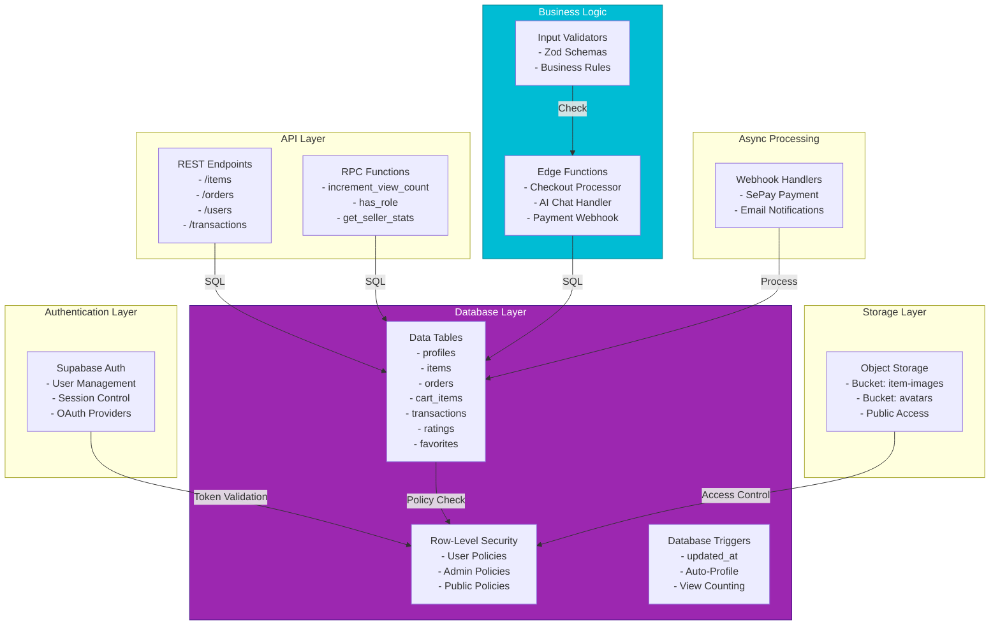

---

## 4. Data Flow Diagram

### 4.1 Item Browsing Flow

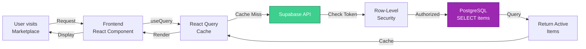

### 4.2 Purchase Flow

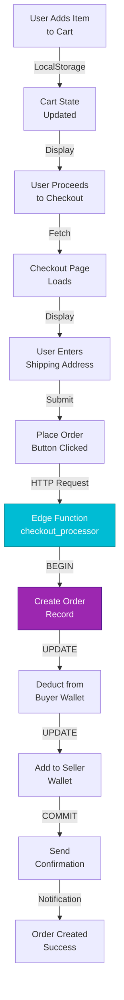

### 4.3 Payment Webhook Flow

```mermaid
graph LR
    SePay["SePay<br/>Payment Processed"]
    Webhook["SePay Sends<br/>Webhook"]
    EdgeFunc["Edge Function<br/>sepay-webhook"]
    Verify["Verify Request<br/>Signature"]
    Parse["Parse Payment<br/>Data"]
    Query["Query Transaction<br/>by Code"]
    Update["Update Status<br/>to Completed"]
    Notify["Send Notifications<br/>Seller/Buyer"]
    Response["Return 200<br/>OK"]
    
    SePay -->|HTTP POST| Webhook
    Webhook -->|Process| EdgeFunc
    EdgeFunc -->|Check| Verify
    Verify -->|Extract| Parse
    Parse -->|Find| Query
    Query -->|UPDATE| Update
    Update -->|Async| Notify
    Notify -->|HTTP| Response
    
    style EdgeFunc fill:#00BCD4,stroke:#00838F,color:#fff
    style Notify fill:#FF9800,stroke:#E65100,color:#fff
```

### 4.4 AI Chat Flow

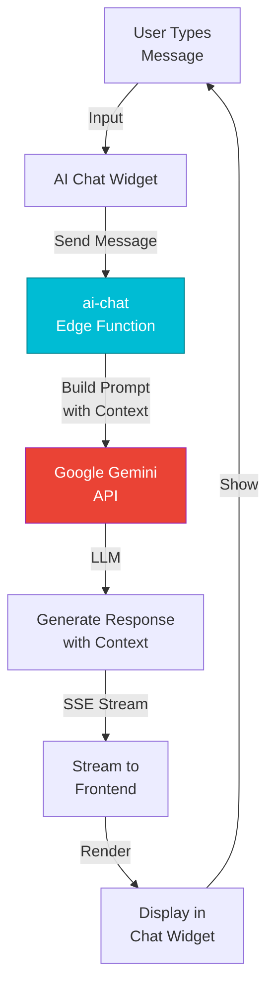

---

## 5. Database Design

### 5.1 Entity Relationship Diagram (ERD)

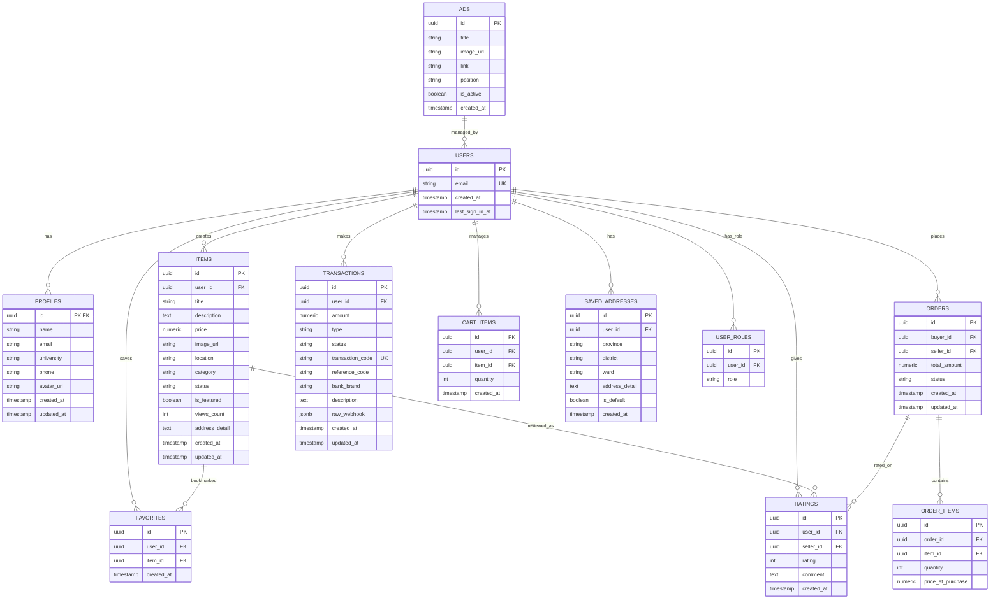

### 5.2 Database Schema

#### Core Tables

**PROFILES** - User extended information
```sql
- id (UUID, PK, FK to auth.users)
- name (TEXT)
- email (TEXT)
- university (TEXT)
- phone (TEXT)
- avatar_url (TEXT)
- created_at (TIMESTAMPTZ)
- updated_at (TIMESTAMPTZ)
```

**ITEMS** - Product listings
```sql
- id (UUID, PK)
- user_id (UUID, FK to users)
- title (TEXT, NOT NULL)
- description (TEXT)
- price (NUMERIC)
- image_url (TEXT)
- location (TEXT)
- category (TEXT)
- address_detail (TEXT) -- Specific address info
- status (TEXT) -- 'active', 'sold', 'hidden'
- is_featured (BOOLEAN)
- views_count (INTEGER)
- created_at (TIMESTAMPTZ)
- updated_at (TIMESTAMPTZ)

Indexes: user_id, category, status, created_at DESC
```

**ORDERS** - Purchase records
```sql
- id (UUID, PK)
- buyer_id (UUID, FK to users)
- seller_id (UUID, FK to users)
- total_amount (NUMERIC)
- status (TEXT) -- 'pending', 'confirmed', 'shipped', 'delivered', 'completed'
- created_at (TIMESTAMPTZ)
- updated_at (TIMESTAMPTZ)
```

**ORDER_ITEMS** - Items in orders
```sql
- id (UUID, PK)
- order_id (UUID, FK to orders)
- item_id (UUID, FK to items)
- quantity (INTEGER)
- price_at_purchase (NUMERIC)
```

**CART_ITEMS** - Shopping cart
```sql
- id (UUID, PK)
- user_id (UUID, FK to users)
- item_id (UUID, FK to items)
- quantity (INTEGER)
- created_at (TIMESTAMPTZ)
```

**TRANSACTIONS** - Wallet operations
```sql
- id (UUID, PK)
- user_id (UUID, FK to users)
- amount (NUMERIC)
- type (TEXT) -- 'deposit', 'listing_fee', 'refund'
- status (TEXT) -- 'pending', 'completed', 'failed'
- transaction_code (TEXT, UNIQUE) -- User bank transfer code
- reference_code (TEXT) -- From SePay
- bank_brand (TEXT)
- description (TEXT)
- raw_webhook (JSONB) -- Raw SePay webhook data
- created_at (TIMESTAMPTZ)
- updated_at (TIMESTAMPTZ)

Indexes: user_id, transaction_code
```

**RATINGS** - Seller ratings
```sql
- id (UUID, PK)
- user_id (UUID, FK to users) -- Rater
- seller_id (UUID, FK to users) -- Rated seller
- rating (INTEGER) -- 1-5
- comment (TEXT)
- created_at (TIMESTAMPTZ)

Unique: (user_id, seller_id)
```

**FAVORITES** - Saved items
```sql
- id (UUID, PK)
- user_id (UUID, FK to users)
- item_id (UUID, FK to items)
- created_at (TIMESTAMPTZ)

Unique: (user_id, item_id)
```

**SAVED_ADDRESSES** - User shipping addresses
```sql
- id (UUID, PK)
- user_id (UUID, FK to users)
- province (TEXT)
- district (TEXT)
- ward (TEXT)
- address_detail (TEXT)
- is_default (BOOLEAN)
- created_at (TIMESTAMPTZ)
```

**USER_ROLES** - Admin role assignment
```sql
- id (UUID, PK)
- user_id (UUID, FK to users)
- role (app_role) -- ENUM: 'admin', 'moderator', 'user'

Unique: (user_id, role)
```

**ADS** - Banner advertisements
```sql
- id (UUID, PK)
- title (TEXT)
- image_url (TEXT)
- link (TEXT)
- position (TEXT) -- 'home', 'detail'
- is_active (BOOLEAN)
- created_at (TIMESTAMPTZ)
```

### 5.3 Row-Level Security (RLS) Policies

**Profiles**
- SELECT: Anyone can view any profile
- UPDATE: Users can update own profile
- INSERT: Users can insert own profile

**Items**
- SELECT: Active items visible to all; hidden items only to owner or admins
- INSERT: Authenticated users can create items
- UPDATE/DELETE: Users can only modify own items; admins can modify all

**Transactions**
- SELECT: Users see own transactions; admins see all
- All operations protected by role checks

**Orders**
- SELECT: Buyers see own orders; sellers see orders where they are seller; admins see all
- Management restricted to authorized parties

**Cart Items**
- SELECT: Users see own cart
- INSERT/UPDATE/DELETE: Users manage own cart only

### 5.4 Indexes & Performance

```sql
-- Items
CREATE INDEX idx_items_user_id ON public.items(user_id);
CREATE INDEX idx_items_category ON public.items(category);
CREATE INDEX idx_items_status ON public.items(status);
CREATE INDEX idx_items_created_at ON public.items(created_at DESC);

-- Transactions
CREATE INDEX idx_transactions_user_id ON public.transactions(user_id);
CREATE INDEX idx_transactions_code ON public.transactions(transaction_code);

-- Orders
CREATE INDEX idx_orders_buyer_id ON public.orders(buyer_id);
CREATE INDEX idx_orders_seller_id ON public.orders(seller_id);
CREATE INDEX idx_orders_status ON public.orders(status);

-- Cart
CREATE UNIQUE INDEX idx_cart_unique ON public.cart_items(user_id, item_id);
```

### 5.5 Database Triggers

**update_updated_at_column**
- Automatically updates `updated_at` timestamp on record modification
- Applied to: profiles, items, orders, transactions

**handle_new_user**
- Auto-creates profile record when new auth user registered
- Sets name from user metadata or email

**increment_view_count RPC**
- Increments views counter when item viewed

---

## 6. API Design

### 6.1 Frontend-to-Backend Communication

#### REST API Endpoints (via Supabase JS Client)

**Authentication**
```
POST /auth/v1/signup
  - Create user account
  - Body: { email, password, data: { name } }
  - Response: { user, session }

POST /auth/v1/signin
  - Login
  - Body: { email, password }
  - Response: { user, session }

POST /auth/v1/signout
  - Logout
  - Response: { success }

POST /auth/v1/oauth/{provider}
  - OAuth redirect (Google, etc.)
  - Response: { url }
```

**Items (Browse & Manage)**
```
GET /rest/v1/items?select=*&status=eq.active&limit=20&offset=0
  - List items with filters
  - Query params: category, location, price range, sort, pagination
  - Response: Item[]

GET /rest/v1/items?id=eq.{id}
  - Get single item detail
  - Response: Item

POST /rest/v1/items
  - Create new item
  - Headers: Authorization
  - Body: { title, description, price, category, location, image_url }
  - Response: { id, ... }

PATCH /rest/v1/items?id=eq.{id}
  - Update item
  - Headers: Authorization
  - Body: Partial<Item>
  - Response: Item

DELETE /rest/v1/items?id=eq.{id}
  - Delete item
  - Headers: Authorization
  - Response: { success }
```

**Shopping Cart**
```
GET /rest/v1/cart_items?user_id=eq.{userId}
  - Get user's cart
  - Response: CartItem[]

POST /rest/v1/cart_items
  - Add to cart
  - Body: { user_id, item_id, quantity }
  - Response: CartItem

PATCH /rest/v1/cart_items?id=eq.{id}
  - Update cart item quantity
  - Body: { quantity }
  - Response: CartItem

DELETE /rest/v1/cart_items?id=eq.{id}
  - Remove from cart
  - Response: { success }
```

**Orders**
```
POST /rest/v1/orders
  - Create order (via Edge Function)
  - Body: { buyer_id, items, shipping_address }
  - Response: { order_id, status }

GET /rest/v1/orders?buyer_id=eq.{userId}
  - Get user's orders
  - Response: Order[]

GET /rest/v1/orders?seller_id=eq.{userId}
  - Get seller's incoming orders
  - Response: Order[]

PATCH /rest/v1/orders?id=eq.{id}
  - Update order status
  - Body: { status }
  - Response: Order
```

**Transactions & Wallet**
```
GET /rest/v1/transactions?user_id=eq.{userId}
  - Get transaction history
  - Query: type, status, date range
  - Response: Transaction[]

POST /rest/v1/transactions
  - Create deposit transaction (SePay webhook)
  - Body: { user_id, amount, transaction_code }
  - Response: Transaction
```

**Ratings & Reviews**
```
GET /rest/v1/ratings?seller_id=eq.{sellerId}
  - Get seller's ratings
  - Response: Rating[]

POST /rest/v1/ratings
  - Create rating
  - Body: { user_id, seller_id, rating, comment }
  - Response: Rating

PATCH /rest/v1/ratings?id=eq.{id}
  - Update rating
  - Body: Partial<Rating>
  - Response: Rating
```

**Favorites**
```
GET /rest/v1/favorites?user_id=eq.{userId}
  - Get user's favorites
  - Response: Favorite[]

POST /rest/v1/favorites
  - Add favorite
  - Body: { user_id, item_id }
  - Response: Favorite

DELETE /rest/v1/favorites?id=eq.{id}
  - Remove favorite
  - Response: { success }
```

### 6.2 Edge Function APIs

**checkout_processor**
```
Function: POST /functions/v1/checkout-processor
Purpose: Handle order creation with wallet deduction
Auth: Authorization Bearer {token}

Request:
{
  "buyer_id": "uuid",
  "items": [
    { "item_id": "uuid", "quantity": 1 },
    ...
  ],
  "shipping_address": {
    "province": "string",
    "district": "string",
    "ward": "string",
    "address_detail": "string"
  }
}

Response:
{
  "success": true,
  "order_id": "uuid",
  "total_amount": 500000,
  "status": "pending"
}

Errors:
- 400: Invalid items
- 402: Insufficient wallet balance
- 409: Item sold/hidden
```

**ai-chat**
```
Function: POST /functions/v1/ai-chat
Purpose: AI product recommendation and customer support
Auth: Optional (public endpoint with rate limiting)

Request:
{
  "message": "string",
  "context": {
    "user_id": "uuid?",
    "category": "string?",
    "price_range": [min, max]?
  }
}

Response: Server-Sent Events Stream
data: {"role": "assistant", "content": "...chunk..."}

Errors:
- 429: Rate limit exceeded
- 503: AI service unavailable
```

**sepay-webhook**
```
Function: POST /functions/v1/sepay-webhook
Purpose: Handle SePay payment confirmation
Auth: Signature verification (HMAC-SHA256)

Request (Webhook):
{
  "transaction_code": "NAPTIEN_12345",
  "amount": 500000,
  "bank_brand": "VIETINBANK",
  "status": "success",
  "timestamp": 1234567890,
  "signature": "..."
}

Response:
{
  "success": true,
  "message": "Transaction processed"
}

Errors:
- 401: Invalid signature
- 400: Malformed request
- 404: Transaction not found
```

### 6.3 Real-time Subscriptions (Supabase Realtime)

```typescript
// Subscribe to order status changes
supabase
  .channel('orders')
  .on('postgres_changes', 
    { event: 'UPDATE', schema: 'public', table: 'orders' },
    (payload) => console.log('Order updated:', payload)
  )
  .subscribe();

// Subscribe to transaction updates
supabase
  .channel('transactions')
  .on('postgres_changes',
    { event: 'INSERT', schema: 'public', table: 'transactions' },
    (payload) => console.log('New transaction:', payload)
  )
  .subscribe();
```

### 6.4 Error Handling Standards

```typescript
// Standardized error response format
{
  "success": false,
  "error": {
    "code": "INSUFFICIENT_BALANCE",
    "message": "User error message",
    "details": {} // Additional context
  },
  "timestamp": "2026-05-11T10:00:00Z"
}

// HTTP Status Codes
200 OK
201 Created
400 Bad Request
401 Unauthorized
402 Payment Required
403 Forbidden
404 Not Found
409 Conflict (Item sold, etc.)
429 Too Many Requests
500 Internal Server Error
503 Service Unavailable
```

---

## 7. Design Patterns & Principles

### 7.1 Architectural Patterns

**Model-View-Controller (MVC) adapted for React**
- **Model**: React Query (state management + data fetching)
- **View**: React Components with Tailwind CSS
- **Controller**: Custom hooks (useAuth, useLocationPicker, etc.)

**Repository Pattern**
- Supabase client acts as data access layer
- Abstraction from calling code

**Singleton Pattern**
- Supabase client instance (single connection pool)
- QueryClient instance (shared across app)
- AuthContext (single auth state for entire app)

**Observer Pattern**
- Supabase Realtime subscriptions notify UI of changes
- React Query automatic refetch on mutation

**Factory Pattern**
- Component factories for UI elements
- Hook factories for common logic

### 7.2 Design Principles

**SOLID Principles**

| Principle | Application |
|-----------|-------------|
| **S** - Single Responsibility | Each component/hook has one purpose |
| **O** - Open/Closed | Components open for extension via props |
| **L** - Liskov Substitution | UI components are interchangeable |
| **I** - Interface Segregation | Minimal prop interfaces |
| **D** - Dependency Inversion | Depend on abstractions (React Query, hooks) |

**DRY (Don't Repeat Yourself)**
- Reusable component library (shadcn/ui)
- Custom hooks for common patterns
- Shared utility functions in `/lib`

**KISS (Keep It Simple, Stupid)**
- Avoid over-engineering
- Serverless backend (no complex deployment)
- Client-driven architecture

**Separation of Concerns**
- Business logic in Edge Functions
- UI logic in React components
- Data access via Supabase client
- Authentication via Supabase Auth

### 7.3 Frontend Patterns

**Compound Components**
```tsx
// Dialog composed from primitives
<Dialog>
  <DialogTrigger>Open</DialogTrigger>
  <DialogContent>
    <DialogHeader>Title</DialogHeader>
    <DialogBody>Content</DialogBody>
  </DialogContent>
</Dialog>
```

**Custom Hooks for Logic Reuse**
```tsx
const useProducts = (filters) => {
  return useQuery({
    queryKey: ['products', filters],
    queryFn: () => fetchProducts(filters)
  });
};
```

**Context for Cross-Cutting Concerns**
```tsx
<AuthProvider>
  <TooltipProvider>
    <App />
  </TooltipProvider>
</AuthProvider>
```

**Higher-Order Components (HOCs) via Wrappers**
```tsx
// Protect routes
<ProtectedRoute role="admin">
  <Admin />
</ProtectedRoute>
```

### 7.4 Backend Patterns

**Middleware/Guards in Edge Functions**
```typescript
async function checkAuth(req) {
  const token = req.headers.get('authorization');
  if (!token) throw new Error('Unauthorized');
  return await supabase.auth.getUser(token);
}
```

**Transaction-Based Operations**
```sql
BEGIN;
  INSERT INTO orders ...;
  UPDATE profiles SET wallet = wallet - amount WHERE id = buyer_id;
  UPDATE profiles SET wallet = wallet + amount WHERE id = seller_id;
COMMIT;
```

**Row-Level Security for Multi-Tenancy**
```sql
CREATE POLICY "Users see own data"
  ON tables FOR SELECT
  USING (auth.uid() = user_id);
```

**Webhook Signature Verification**
```typescript
const calculatedSignature = hmacSha256(payload, secret);
if (calculatedSignature !== receivedSignature) {
  throw new Error('Signature validation failed');
}
```

---

## 8. Module Breakdown

### 8.1 Frontend Modules

```
src/
├── pages/                    # Route-level components
│   ├── Index.tsx            # Marketplace browse (16KB)
│   ├── ItemDetail.tsx       # Product detail (12KB)
│   ├── PostItem.tsx         # List new item (10KB)
│   ├── Cart.tsx             # Shopping cart (8KB)
│   ├── Checkout.tsx         # Payment flow (12KB)
│   ├── Auth.tsx             # Login/SignUp (14KB)
│   ├── Profile.tsx          # User settings (10KB)
│   ├── Admin.tsx            # Admin dashboard (20KB)
│   ├── SellerProfile.tsx    # Seller showcase (8KB)
│   ├── SellerOrders.tsx     # Order management (10KB)
│   └── [other pages]
│
├── components/
│   ├── AdBanner.tsx         # Ad display
│   ├── AIChatWidget.tsx     # Chat interface
│   ├── CategoryChips.tsx    # Filter UI
│   ├── FilterPanel.tsx      # Advanced filters
│   ├── ProductCard.tsx      # Item card
│   ├── SearchBar.tsx        # Search input
│   ├── layout/
│   │   ├── Navbar.tsx       # Top navigation
│   │   └── Footer.tsx       # Page footer
│   ├── ui/                  # shadcn components (40+ files)
│   │   ├── button.tsx
│   │   ├── input.tsx
│   │   ├── dialog.tsx
│   │   ├── sheet.tsx
│   │   └── ...
│
├── hooks/
│   ├── useAuth.tsx          # Authentication state (50 lines)
│   ├── useLocationPicker.ts # Location selection (100 lines)
│   ├── use-mobile.tsx       # Mobile detection (20 lines)
│   ├── use-toast.ts         # Toast notifications (30 lines)
│   └── useLastRoute.ts      # Route history (40 lines)
│
├── integrations/
│   ├── supabase/
│   │   ├── client.ts        # Supabase client singleton
│   │   └── types.ts         # Generated TypeScript types
│   └── lovable/             # Lovable platform integration
│
├── lib/
│   ├── constants.ts         # App-wide constants
│   ├── universities.ts      # University database
│   ├── utils.ts             # Helper functions
│   └── validators.ts        # Zod schemas
│
├── assets/                  # Images, icons, fonts
│
├── App.tsx                  # Root component (40 lines)
├── App.css                  # Global styles
├── main.tsx                 # Vite entry point
└── index.css                # Base Tailwind
```

**Total Frontend ~400KB (minified + gzipped: ~80-100KB)**

### 8.2 Backend Modules (Supabase)

```
supabase/
├── functions/
│   ├── checkout-processor/
│   │   └── index.ts         # Order creation + payment (150 lines)
│   │
│   ├── ai-chat/
│   │   └── index.ts         # Gemini integration (200 lines)
│   │
│   ├── sepay-webhook/
│   │   └── index.ts         # Payment webhook handler (120 lines)
│   │
│   └── seed-data/
│       └── index.ts         # Data seeding (100 lines)
│
├── migrations/
│   ├── 001_schema.sql       # Initial tables + RLS
│   ├── 002_orders.sql       # Order tables
│   ├── 003_transactions.sql # Transaction handling
│   └── ...                  # 12 total migrations
│
└── config.toml              # Supabase project config
```

### 8.3 Dependency Graph

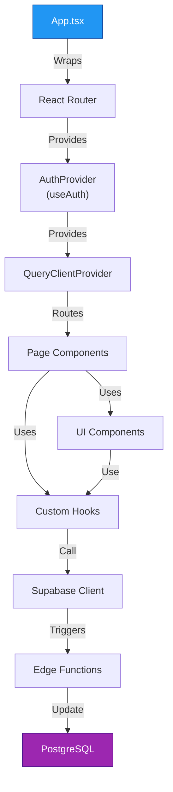

---

## 9. Technology Stack & Justifications

### 9.1 Frontend Technology Decisions

| Technology | Version | Rationale | Alternatives Considered |
|-----------|---------|-----------|------------------------|
| **React** | 18.3.1 | Industry standard, large ecosystem, component model | Vue, Svelte, Angular |
| **TypeScript** | 5.8 | Type safety reduces bugs, better IDE support | JavaScript, ReScript |
| **Vite** | 5.4 | Fast build times, HMR, modern development experience | Webpack, Parcel, esbuild |
| **React Router** | 6.x | Latest stable, good performance, intuitive API | TanStack Router, Remix, Next.js |
| **React Query** | 5.83 | Powerful data fetching & caching, reduces boilerplate | Redux, Zustand, Jotai |
| **Tailwind CSS** | 3.4 | Utility-first, highly customizable, great for rapid UI | Bootstrap, Material-UI, CSS Modules |
| **shadcn/ui** | Latest | Composable, accessible Radix-based components | Material-UI, Chakra-UI, Ant Design |
| **Framer Motion** | 11 | Smooth animations, good React integration | React Spring, GSAP, CSS animations |
| **Zod** | 3.25 | Runtime validation, TypeScript-first | Yup, Joi, Superstruct |
| **Lucide Icons** | 0.462 | Tree-shakeable, lightweight (20KB), well-maintained | Heroicons, Font Awesome, Bootstrap Icons |
| **Sonner** | 1.7 | Toast notifications with good UX, small bundle | React Toastify, Hot Toast, React Hot Toast |

### 9.2 Backend Technology Decisions

| Technology | Rationale | Trade-offs |
|-----------|-----------|-----------|
| **Supabase** | PostgreSQL database with Auth, RLS, Realtime built-in; reduces backend complexity | Vendor lock-in; limited customization vs self-hosted |
| **PostgreSQL** | Mature, reliable, powerful query capabilities, excellent for relational data | Not ideal for document-heavy or graph data |
| **Edge Functions (Deno)** | Serverless, auto-scaling, pay-per-execution model, fast cold starts | Limited runtime, lower concurrency than traditional servers |
| **Row-Level Security (RLS)** | Multi-tenancy security at DB level, automatic enforcement | Added complexity to schema design |
| **JWT Tokens** | Stateless auth, scales well horizontally, works with serverless | Token revocation is tricky |

### 9.3 External Services

| Service | Purpose | Justification |
|---------|---------|---------------|
| **Google Gemini 2.5 Flash** | AI chat & product recommendations | State-of-the-art LLM, fast, cost-effective |
| **SePay** | Payment processing (Vietnamese market) | Integrated with VN banking system |
| **Vercel/Netlify** | Frontend hosting & CDN | Optimal for static sites + serverless functions |

### 9.4 Development Tools

| Tool | Purpose |
|------|---------|
| **Bun** | Fast package manager & runtime |
| **Vitest** | Unit testing framework |
| **Playwright** | E2E testing |
| **ESLint** | Code quality & consistency |
| **PostCSS** | CSS processing (Tailwind) |
| **TypeScript ESLint** | TS-specific linting |

---

## 10. Security Architecture

### 10.1 Authentication & Authorization

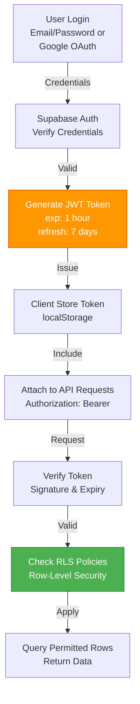

### 10.2 Security Layers

**Layer 1: Edge (Frontend)**
- HTTPS/TLS encryption in transit
- Content Security Policy (CSP) headers
- CORS properly configured
- Input validation with Zod schemas

**Layer 2: Application (Supabase)**
- JWT token validation on every request
- Edge Function signature verification for webhooks
- Request rate limiting
- CORS policy enforcement

**Layer 3: Database (PostgreSQL)**
- Row-Level Security (RLS) policies
- Parameterized queries (SQL injection prevention)
- No direct database access from client
- Foreign key constraints enforce data integrity

**Layer 4: External Services**
- API key management in environment variables
- Webhook signature verification (HMAC-SHA256)
- OAuth for third-party integrations
- Minimal data exposure to external services

### 10.3 RLS Policy Examples

**Profile Access**
```sql
-- Anyone can view any profile (public)
CREATE POLICY "Profiles viewable by everyone"
  ON public.profiles FOR SELECT USING (true);

-- Users can only modify own profile
CREATE POLICY "Users can update own profile"
  ON public.profiles FOR UPDATE
  USING (auth.uid() = id);

-- Admins can view/manage all profiles
CREATE POLICY "Admins can view all profiles"
  ON public.profiles FOR ALL
  USING (has_role(auth.uid(), 'admin'));
```

**Item Visibility**
```sql
-- Active items visible to all; private/hidden only to owner/admin
CREATE POLICY "Active items viewable by everyone"
  ON public.items FOR SELECT
  USING (status = 'active' OR auth.uid() = user_id);

-- Only owner and admins can modify
CREATE POLICY "Users can update own items"
  ON public.items FOR UPDATE
  USING (auth.uid() = user_id OR has_role(auth.uid(), 'admin'));
```

**Transaction Privacy**
```sql
-- Users see only own transactions; admins see all
CREATE POLICY "Users view own transactions"
  ON public.transactions FOR SELECT
  USING (auth.uid() = user_id);

CREATE POLICY "Admins manage all transactions"
  ON public.transactions FOR ALL
  USING (has_role(auth.uid(), 'admin'::app_role));
```

### 10.4 Data Protection

**PII Handling**
- Email addresses stored in Supabase Auth (hashed)
- Phone numbers encrypted in database
- Addresses only visible to order participants
- User profiles public by default (privacy control option)

**Payment Data**
- No credit card storage (delegated to SePay)
- Transaction records include only reference codes
- Webhook data validated before storage
- Transaction codes masked in UI

**Session Management**
- Tokens expire in 1 hour
- Refresh tokens valid for 7 days
- Token stored in localStorage (HTTPS only)
- Logout clears token immediately
- Concurrent session limit: 10 per user

### 10.5 Common Attack Prevention

| Attack Type | Prevention Mechanism |
|------------|----------------------|
| **SQL Injection** | Parameterized queries via Supabase client |
| **XSS** | React auto-escapes text; CSP headers |
| **CSRF** | SameSite cookies; CORS validation |
| **Man-in-the-Middle** | TLS/SSL; Supabase Auth uses HTTPS |
| **Unauthorized Access** | JWT validation; RLS policies |
| **Rate Limiting** | Edge Functions with rate limiting |
| **Replay Attack** | Webhook signature verification; timestamp checks |
| **Privilege Escalation** | Role-based access control; RLS enforcement |

### 10.6 Secret Management

**Environment Variables** (not committed to repo)
```
VITE_SUPABASE_URL          # Supabase project URL
VITE_SUPABASE_PUBLISHABLE_KEY  # Public anon key
SUPABASE_SERVICE_ROLE_KEY  # Service role (admin)
AI_API_KEY                 # Gemini API key
SEPAY_API_KEY              # SePay webhook secret
```

**Key Rotation Strategy**
- Quarterly rotation for service role key
- API keys stored in Supabase Vault (for Edge Functions)
- Webhook secrets versioned for safe rotation

---

## 11. Performance Considerations

### 11.1 Frontend Performance

**Page Load Optimization**
- Code splitting by route (React Router lazy loading)
- Image optimization (lazy loading, WebP format)
- Bundle size: ~80-100KB gzipped
- Lighthouse target: 90+ score

**Caching Strategy**
```typescript
// React Query cache configuration
const queryClient = new QueryClient({
  defaultOptions: {
    queries: {
      staleTime: 5 * 60 * 1000,        // 5 minutes
      gcTime: 10 * 60 * 1000,          // 10 minutes
      retry: 1,
      retryDelay: 1000
    }
  }
});
```

**API Request Optimization**
- Batch requests where possible (GraphQL could improve this)
- Debounce search queries (500ms)
- Pagination (20 items per page default)
- Query parameters for filtering (reduces data transfer)

### 11.2 Database Optimization

**Indexes**
- Covering indexes on frequently filtered columns
- Composite indexes for common query patterns
- BTREE for equality/range searches
- Regular index analysis and maintenance

**Query Performance**
- Views for complex queries are created as needed
- Avoid N+1 queries (use explicit joins in REST API)
- Connection pooling via Supabase
- Max statement timeout: 30 seconds

**Replication & Backup**
- Point-in-time recovery (PITR) enabled
- Daily backups retained for 7 days
- Read replicas for reporting queries (future)

### 11.3 Backend Performance

**Edge Function Optimization**
- Deno runtime: ~50ms cold start
- Keep functions under 5MB bundle
- Use streaming for real-time AI responses
- Cache common computations at function level

**Database Connection**
- Connection pooling: max 20 connections
- Idle timeout: 30 minutes
- Reset after each function execution

### 11.4 Content Delivery

**CDN Strategy**
- Static assets via Vercel CDN (global)
- Images cached for 30 days
- API responses not cached at CDN (auth-dependent)
- Regional routing for lower latency

**Compression**
- Gzip compression for text assets
- Brotli for modern browsers
- WebP images for 25% size reduction

---

## 12. Deployment Architecture

### 12.1 Environment Setup

```
Development:
  Frontend: http://localhost:5173 (Vite dev server)
  Backend: Local Supabase (supabase start)
  E2E: Runs against local environment

Staging:
  Frontend: https://staging.sth.vn (Vercel preview)
  Backend: Supabase staging project
  Testing: Full test suite before merge

Production:
  Frontend: https://www.sth.vn (Vercel production)
  Backend: Supabase production cluster
  Database: Backup-enabled, monitoring active
```

### 12.2 CI/CD Pipeline

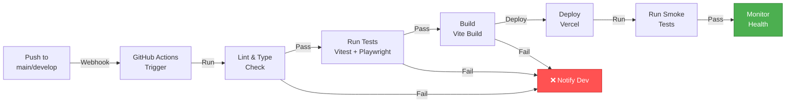

### 12.3 Deployment Checklist

**Pre-Deployment**
- [ ] All tests passing
- [ ] Code review approved
- [ ] No console errors/warnings
- [ ] Bundle size within limits
- [ ] Database migrations tested
- [ ] Environment variables configured

**Deployment**
- [ ] Tag release version
- [ ] Deploy to staging first
- [ ] Run smoke tests
- [ ] Approve production deployment
- [ ] Deploy frontend to Vercel
- [ ] Deploy Edge Functions to Supabase
- [ ] Verify all services online

**Post-Deployment**
- [ ] Monitor error logs (Sentry, LogRocket)
- [ ] Check performance metrics
- [ ] Verify payments processing
- [ ] Test key user flows
- [ ] Rollback plan ready if issues

### 12.4 Monitoring & Observability

**Error Tracking**
- Sentry for JavaScript errors
- Supabase error logs for backend
- Custom error boundary components

**Performance Monitoring**
- Web Vitals (LCP, FID, CLS)
- Database query performance
- API response times
- Edge Function execution time

**User Analytics**
- Amplitude for event tracking
- Conversion funnels
- User segmentation
- A/B testing framework

**Alerting**
- High error rate (> 1%)
- Payment processor downtime
- Database connection failures
- API response time degradation (> 2s)

---

## Appendix: Glossary of Terms

| Term | Definition |
|------|-----------|
| **RLS** | Row-Level Security - Database-level access control |
| **JWT** | JSON Web Token - Stateless authentication token |
| **OAuth** | Open Authorization - Third-party authentication protocol |
| **Edge Function** | Serverless function deployed at edge locations |
| **Webhook** | HTTP callback for event notifications |
| **SPA** | Single Page Application - Client-side rendered app |
| **REST** | Representational State Transfer - API architecture style |
| **CORS** | Cross-Origin Resource Sharing - Browser security policy |
| **CDN** | Content Delivery Network - Distributed file servers |
| **Realtime** | WebSocket-based live data synchronization |
| **Fallback** | Backup plan if primary fails |

---

## Document Approval & Version History

| Version | Date | Author | Status | Notes |
|---------|------|--------|--------|-------|
| 1.0 | May 11, 2026 | Architecture Team | Active | Initial SDD document |

---

**End of Software Design Document**
